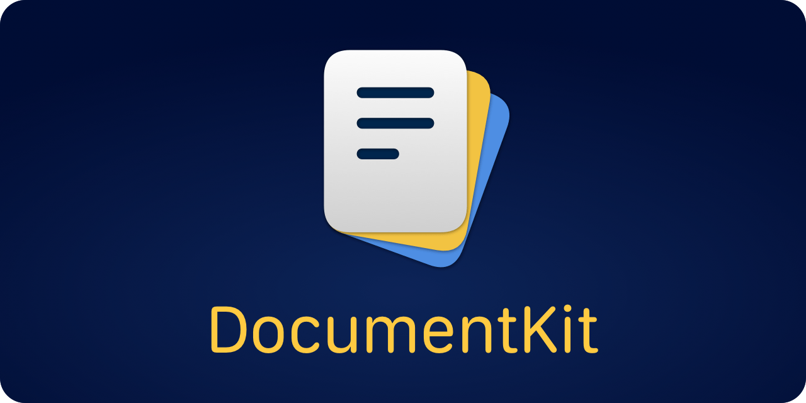

<p align="center">
    
</p>

<p align="center">
    
    
    
    
    <a href="https://twitter.com/danielsaidi"></a>
    <a href="https://mastodon.social/@danielsaidi"></a>
</p>


## About DocumentKit

DocumentKit is a SwiftUI SDK that adds more capabilities to `DocumentGroup`-based apps.

`DocumentGroup`-based apps are in quite limited when it comes to customization. DocumentKit makes it easier to add custom items to the document browser, present splash and onboarding screens at startup, etc.

This lets you create a better user experience for your `DocumentGroup`-based apps.


## ‼️ Important Information

iOS 18 changed how `DocumentGroup` looks and behaves, by completely changing the underlying types. You can now do a lot more things than before, which makes this SDK less useful. 

While this version fixes a few things, and for instance makes the modal screens work, the `UIDocumentBrowserViewController` customizations no longer work, since the `DocumentGroup` uses a new underlying type.

Since you can now do more with the native `DocumentGroup`, this verison will remain as is until iOS 19 is released, then removed...unless anyone comes up with another way to use it in iOS 18.


## Installation

DocumentKit can be installed with the Swift Package Manager:

```
https://github.com/danielsaidi/DocumentKit.git
```


## Getting started

DocumentKit extends `DocumentGroup` with modifiers that let you add custom toolbar items, customize the document browser etc.:

```swift
@main
struct MyApp: App {

    var body: some Scene {
        DocumentGroup(newDocument: DemoDocument()) { file in
            ContentView(document: file.$document)
        }
        .additionalNavigationBarButtonItems(
            leading: [...],
            trailing: [...]
        )
        .allowsDocumentCreation(true)
        .allowsPickingMultipleItems(true)
        .showFileExtensions(true)
        .onboardingSheet {
            MyOnboardingScreen()
        }
        .splashSheet {
            MySplashScreen()
        }
    }
}
```

DocumentKit also extends `DocumentGroup` with modifiers that let you present onboarding modals and splash screens when the app launches, lets you inspect the underlying document browser, etc.

See the online [getting started guide][Getting-Started] for more information. 


## Documentation

The online [documentation][Documentation] has more information, articles, code examples, etc.


## Support my work

You can [sponsor me][Sponsors] on GitHub Sponsors or [reach out][Email] for paid support, to help support my [open-source projects][OpenSource].

Your support makes it possible for me to put more work into these projects and make them the best they can be.


## Contact

Feel free to reach out if you have questions or if you want to contribute in any way:

* Website: [danielsaidi.com][Website]
* Mastodon: [@danielsaidi@mastodon.social][Mastodon]
* Twitter: [@danielsaidi][Twitter]
* E-mail: [daniel.saidi@gmail.com][Email]


## License

DocumentKit is available under the MIT license. See the [LICENSE][License] file for more info.


[Email]: mailto:daniel.saidi@gmail.com

[Website]: https://danielsaidi.com
[GitHub]: https://github.com/danielsaidi
[Twitter]: https://twitter.com/danielsaidi
[Mastodon]: https://mastodon.social/@danielsaidi
[OpenSource]: https://danielsaidi.com/opensource
[Sponsors]: https://github.com/sponsors/danielsaidi

[Documentation]: https://danielsaidi.github.io/DocumentKit
[Getting-Started]: https://danielsaidi.github.io/DocumentKit/documentation/documentkit/getting-started

[License]: https://github.com/danielsaidi/DocumentKit/blob/master/LICENSE
