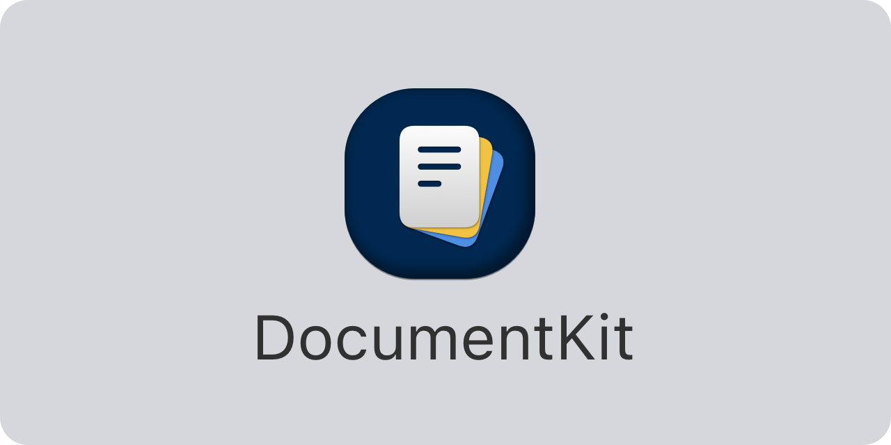

<p align="center">
    
</p>

<p align="center">
    
    
    
    <a href="https://twitter.com/danielsaidi">
        
    </a>
    <a href="https://mastodon.social/@danielsaidi">
        
    </a>
</p>


## About DocumentKit

DocumentKit is a Swift library that adds more capabilities to `DocumentGroup`-based iOS apps.

With DocumentKit, you can add custom toolbar items to the main document browser, present initial onboarding screens, open modal sheets and full screens, etc.


## Installation

DocumentKit can be installed with the Swift Package Manager:

```
https://github.com/danielsaidi/DocumentKit.git
```

If you prefer to not have external dependencies, you can also just copy the source code into your app.


## Supported Platforms

DocumentKit supports `iOS 14` and later.


## Getting started

DocumentKit adds more functionality to `DocumentGroup`.

DocumentKit extends `DocumentGroup` with more modifiers, to let you add custom toolbar items, customize the browser etc.:

```swift
@main
struct MyApp: App {

    var body: some Scene {
        DocumentGroup(newDocument: DemoDocument()) { file in
            ContentView(document: file.$document)
        }
        .additionalNavigationBarButtonItems(
            leading: [...],
            trailing: [...]
        )
        .showFileExtensions(true)
    }
}
```

DocumentKit also extends `DocumentGroup` with a modifier that lets you present an onboarding screen when the app starts for the first time:

```swift
@main
struct DemoApp: App {

    var body: some Scene {
        DocumentGroup(newDocument: DemoDocument()) { file in
            ContentView(document: file.$document)
        }
        .onboardingSheet {
            MyOnboardingScreen()
        }
    }
}

struct MyOnboardingScreen: DocumentGroupModal {

    var body: some View {
        Text("Hello, onboarding!")
    }
}
```
 
Any `DocumentGroupModal` can be presented as a sheet, a full screen cover, or using any UIKit-specific modal presentation type.

For more information, please see the [online documentation][Documentation] and [getting started guide][Getting-Started] guide. 


## Documentation

The [online documentation][Documentation] contains more information, code examples, etc., and makes it easy to overview the various parts of the library.


## Demo Application

The demo app lets you explore the library on iOS and macOS. To try it out, just open and run the `Demo` project.


## Support

You can sponsor this project on [GitHub Sponsors][Sponsors] or get in touch for paid support.


## Contact

Feel free to reach out if you have questions or if you want to contribute in any way:

* Website: [danielsaidi.com][Website]
* Mastodon: [@danielsaidi@mastodon.social][Mastodon]
* Twitter: [@danielsaidi][Twitter]
* E-mail: [daniel.saidi@gmail.com][Email]


## License

DocumentKit is available under the MIT license. See the [LICENSE][License] file for more info.


[Email]: mailto:daniel.saidi@gmail.com
[Website]: https://www.danielsaidi.com
[Twitter]: https://www.twitter.com/danielsaidi
[Mastodon]: https://mastodon.social/@danielsaidi
[Sponsors]: https://github.com/sponsors/danielsaidi

[Documentation]: https://danielsaidi.github.io/DocumentKit/documentation/documentkit/
[Getting-Started]: https://danielsaidi.github.io/DocumentKit/documentation/documentkit/getting-started
[License]: https://github.com/danielsaidi/DocumentKit/blob/master/LICENSE
